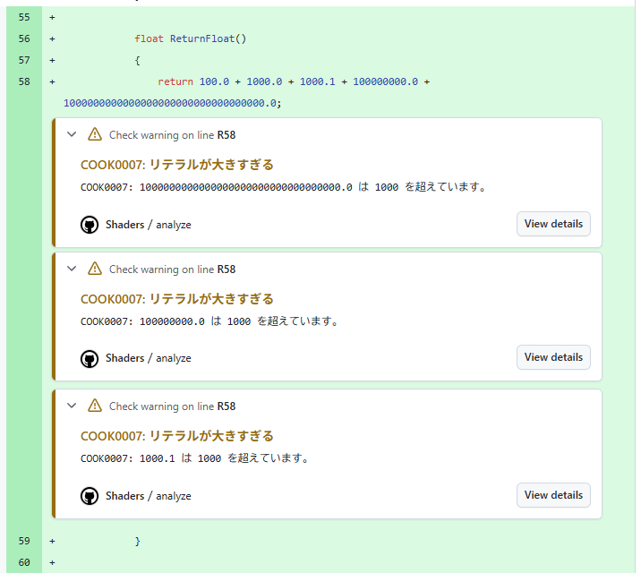

# CI に組み込む

自作ルール入りの解析ツールを、Windows マシンを使った GitHub Actions のセルフホストランナーで、PR ごとに動かすための手順です。
ツールのリリース、ランナーの用意、ワークフロー、キャッシュの順に進めます。

> **公開リポジトリではこの方法を使用しないでください。** 
> セルフホストランナーはコードをそのマシンで実行します

## 目次

- [セルフホストランナーを使用する理由](#セルフホストランナーを使用する理由)
- [全体の流れ](#全体の流れ)
- [1. バイナリをリリースする](#1-バイナリをリリースする)
- [2. セルフホストランナーを用意する](#2-セルフホストランナーを用意する)
- [3. ワークフローを置く](#3-ワークフローを置く)
- [4. キャッシュで 2 回目以降を速くする](#4-キャッシュで-2-回目以降を速くする)

---

## セルフホストランナーを使用する理由

`Packages/com.unity...` 形式の `#include` は、Unity プロジェクトの `Library/PackageCache` から参照するため、`Library` が `.gitignore` されているような、GitHub ホストのランナーでは解決できません。

そこで、`Library` の作られたリポジトリの存在するマシンをランナーにし、ジョブからその `Library` を参照します。

## 全体の流れ

1. 自作ルールと自作ルール入りの CLI のプロジェクトを置いた private リポジトリ (my-shaderlyn) で、CLI ツールをビルドする。
   Shaderlyn 本体は NuGet パッケージとして参照するので、このリポジトリを fork や clone する必要はない
2. my-shaderlyn のリリースにビルドしたCLIツールを置く
   1. バージョンタグをpushしたときにリリースを作成するワークフローを組む
3. 解析したいUnityプロジェクトのリポジトリにセルフホストランナーを設定する
4. 解析したいUnityプロジェクトのPR作成のタイミングでツールを実行するワークフローを組む
5. 動いたら、前回の解析結果を使い回すキャッシュを有効にする

自作ルール入りの CLI の作り方は [自作ルールの作り方](../custom-rules/tutorial.md) にあります。

---

## 1. バイナリをリリースする

`.github/workflows/release.yml` を置き換え、バージョンタグをpushしたときにリリースを作成するワークフローを組みます。

```yaml
name: Release

# v で始まるタグを push したときに実行
on:
  push:
    tags: ["v*"]

# リリース作成用の書き込み権限
permissions:
  contents: write

jobs:
  release:
    # Native AOT ビルドのため、ランナーと同じ Windows を設定
    # windows-latest には AOT のリンクに使う MSVC が入っている
    runs-on: windows-latest

    steps:
      # step1: ランナーにリポジトリソースを取得する
      - uses: actions/checkout@v4

      # step2: ランナーで dotnet コマンドを使用できるようにする
      - uses: actions/setup-dotnet@v4
        with:
          dotnet-version: "10.0.x"

      # step3: 自作ルールのテストを行う (Shaderlyn のパッケージは restore で nuget.org から入る)
      - name: dotnet test
        run: dotnet test --configuration Release

      # step4:  自作ルール入りの CLI を AOT ビルド
      - name: AOT publish
        run: >
          dotnet publish rules/MyShaderRules.Cli/MyShaderRules.Cli.csproj
          --configuration Release
          --runtime win-x64
          --output artifacts

      # step5: publish の出力のうち、exe だけを zip にする
      - name: zip
        shell: pwsh
        run: Compress-Archive -Path artifacts/my-shaderlyn.exe -DestinationPath my-shaderlyn-win-x64.zip

      # step6: リリースを作り zip を添付する
      - uses: softprops/action-gh-release@v2
        with:
          files: my-shaderlyn-win-x64.zip
          # ファイルが見つからなければ失敗させる
          fail_on_unmatched_files: true
```

タグを push して、リリースに `my-shaderlyn-win-x64.zip` が置かれることを確認

```bash
git tag v1.0.0-r1
git push origin v1.0.0-r1
```

---

## 2. セルフホストランナーを用意する

### 2-1. `Library` を作る

1. ランナー用マシンに Unity プロジェクトを置き、Unity で開く
2. `D:/.../MyProject/Library/PackageCache` が作成されていることを確認


`C:\Users\<ユーザー名>\` の下には置かないでください。
ランナーのサービスは既定で `NETWORK SERVICE` として動作するため、ユーザーフォルダー以下を読めません。

### 2-2. マシンをランナーに登録する

1. Unity プロジェクトリポジトリのGitHubページから `Settings → Actions → Runners → New self-hosted runner` を開く
2. マシンの構成を選択し、表示されるコマンドをマシンで順に実行（要管理者権限）
3. configを実行するとランナー登録が開始する
   1. マシンに `unity` ラベルを付ける
      1. `This runner will have the following labels: 'self-hosted', 'Windows', 'X64'
Enter any additional labels (ex. label-1,label-2):` で `unity` を入力します。
   1. サービスとして常駐させる
      1. `config.cmd` の途中の質問 `run the runner as service?` に `Y`
1. Runners の画面で **Idle** になれば完了（明示的に起動する場合、`.\run.cmd`）

失敗した場合は `Settings → Actions → Runners` から失敗したマシンのランナーの Remove runner を選択し、表示されるコマンドを入力してランナーを削除して、再度登録します。

### 2-3. マシンに GitHub CLI(`gh`) を導入

[こちら](https://github.com/cli/cli?ref_product=cli&ref_type=engagement&ref_style=text#installation)を参考にマシンに導入する

導入後、ランナーのサービスを再起動
（`services.msc` で `GitHub Actions Runner (...)` を再起動）

---

## 3. ワークフローを置く

### 3-1. トークンを登録する

ツールのリポジトリは private なので、`GITHUB_TOKEN` ではリリースを取得できません。
そのため、Fine-grained PAT 等を使用してリポジトリへのアクセスを可能にします。

1. `Profile > Settings > Developer Settings > Personal access tokens` から ツールリポジトリへの `Contents: Read-only` を持つ Fine-grained PAT を作成
2. 1 で作成したトークンを Unity プロジェクトのリポジトリの `Settings > Secrets and variables > Actions > Secrets > New repository secret` から `SHADERLYN_TOKEN` として登録

### 3-2. ワークフロー

Unity プロジェクトのリポジトリに `.github/workflows/shaders.yml` を作成

```yaml
name: Shaders

# PR操作のタイミングで実行
on: pull_request

permissions:
  contents: read

jobs:
  analyze:
    # 2 章で unity ラベルを付けた Windows のランナーで実行
    runs-on: [self-hosted, unity]

    defaults:
      run:
        shell: powershell

    env:
      SHADERLYN_REPOSITORY: your-org/my-shaderlyn
      # ルールのバージョンをタグで固定する
      SHADERLYN_VERSION: v1.0.0-r1
      # 2-1 で作った Libraryを指定
      UNITY_LIBRARY: D:\...\MyProject\Library

    steps:
      # PR のコードを取得する
      - uses: actions/checkout@v4

      # ランナーの Library へのジャンクション (フォルダーのリンク) を作る。
      - name: Library をリンクする
        run: |
          if (Test-Path Library) { cmd /c rmdir Library }
          New-Item -ItemType Junction -Path Library -Target $env:UNITY_LIBRARY | Out-Null

      # 1 章で作成したリリースから zip を取得し、作業用の一時フォルダーに展開
      - name: 解析ツールを取得する
        env:
          GH_TOKEN: ${{ secrets.SHADERLYN_TOKEN }}
        run: |
          gh release download $env:SHADERLYN_VERSION `
            --repo $env:SHADERLYN_REPOSITORY `
            --pattern my-shaderlyn-win-x64.zip `
            --dir $env:RUNNER_TEMP `
            --clobber
          if ($LASTEXITCODE -ne 0) { exit 1 }
          Expand-Archive "$env:RUNNER_TEMP\my-shaderlyn-win-x64.zip" -DestinationPath $env:RUNNER_TEMP -Force

      # CLIツールを実行
      ## 1 (指摘あり) と 2 (ツールの失敗) を分けて表示
      - name: シェーダーを解析する
        run: |
          & "$env:RUNNER_TEMP\my-shaderlyn.exe" Assets/Shaders --unity-project . --format github
          $code = $LASTEXITCODE

          switch ($code) {
            0       { Write-Output "No issues found." }
            1       { Write-Output "::error::Shader analysis found issues."; exit 1 }
            default { Write-Output "::error::Shaderlyn failed (exit code $code)."; exit 1 }
          }

      # ジャンクションを削除
      - name: リンクを外す
        if: always()
        run: if (Test-Path Library) { cmd /c rmdir Library }
```

`--format github` により、指摘が PR の差分の該当行に注釈として表示される



---

## 4. キャッシュで 2 回目以降を速くする

ワークフローが動いたら、`--cache` で前回の解析結果を使い回すようにします。
PR で変えていないシェーダーは解析されなくなり、2 回目以降の解析時間が大きく縮みます。

キャッシュはファイルの内容で照合します。取り込んでいるヘッダ (`Library/PackageCache` の中のものを含む) も照合するので、
ヘッダだけを変えた PR でも、それを取り込むシェーダーは解析し直されます。
ブランチや PR が違っても、内容が同じファイルの結果はそのまま使えます。
詳しい仕組みは [CLI の使い方「キャッシュ」](cli-usage.md#7-キャッシュ) にあります。

### 4-1. キャッシュの置き場所を作る

キャッシュファイルは、ランナー用マシンの**作業フォルダーの外**に置きます。
`actions/checkout` は実行のたびに作業フォルダーの追跡されていないファイルを消すため、作業フォルダーの中に置くと毎回消えます。

2-1 の Unity プロジェクトと同じように、`C:\Users\<ユーザー名>\` の下は避けます。
ランナーのサービス (`NETWORK SERVICE`) が書き込めるよう、フォルダーを作って書き込み権限を与えます (管理者の PowerShell で実行)。

```powershell
New-Item -ItemType Directory D:\...\shaderlyn-cache
icacls D:\...\shaderlyn-cache /grant "NETWORK SERVICE:(OI)(CI)M"
```

### 4-2. ワークフローに `--cache` を足す

3-2 のワークフローを、次の 2 か所だけ変えます。

`env` にキャッシュの置き場所を足します。

```yaml
    env:
      SHADERLYN_REPOSITORY: your-org/my-shaderlyn
      SHADERLYN_VERSION: v1.0.0-r1
      UNITY_LIBRARY: D:\...\MyProject\Library
      # 4-1 で作ったフォルダー
      SHADERLYN_CACHE_DIR: D:\...\shaderlyn-cache
```

解析の実行に `--cache` を足します。

```yaml
      - name: シェーダーを解析する
        run: |
          & "$env:RUNNER_TEMP\my-shaderlyn.exe" Assets/Shaders --unity-project . --format github `
            --cache "$env:SHADERLYN_CACHE_DIR\$env:RUNNER_NAME.json"
          $code = $LASTEXITCODE

          switch ($code) {
            0       { Write-Output "No issues found." }
            1       { Write-Output "::error::Shader analysis found issues."; exit 1 }
            default { Write-Output "::error::Shaderlyn failed (exit code $code)."; exit 1 }
          }
```

ファイル名にランナー名 (`RUNNER_NAME`) を入れているのは、同じマシンに複数のランナーを登録したときに、
同時に動くジョブが同じファイルを書き換え合わないようにするためです。ランナーが 1 つなら、ファイルは 1 つになります。

### 4-3. 効いているか確かめる

一度だけ `--timings` を足して 2 回実行し、2 回目のログ (標準エラー) を見ます。

```
  前回の結果の使い回し 118 件 / 解析 2 件 / 記録済み 120 件
```

`使い回し` がほぼ全件なら効いています。確かめたら `--timings` は外して構いません。

### キャッシュについての注意

- **作り直しは自動で行われます。** `SHADERLYN_VERSION` を上げてツールが変わったとき、`.shaderlyn.yaml` を変えたときは、全件を解析し直します。
  Unity を更新して `Library/PackageCache` のヘッダが変わった場合も、それを取り込むシェーダーは解析し直されます
- **読めなくてもジョブは失敗しません。** キャッシュが壊れていたり書き込めなかったりした場合は、標準エラーにその旨を出して全件を解析します。
  ただしそのままでは毎回遅くなるので、ログに `キャッシュを読み込めませんでした` / `キャッシュを書き出せませんでした` が出ていないか一度確かめてください
- **結果がおかしいと思ったら、キャッシュファイルを消してください。** 次の実行で全件を解析し、作り直されます
- **キャッシュはランナーのマシンごとのものです。** 記録は絶対パスで持っているので、別のマシンへ複製しても使えません

---

## 関連

- [自作ルールの作り方](../custom-rules/tutorial.md) — 自作ルール入りの CLI の作り方
- [CLI の使い方](cli-usage.md) — 実行方法、出力、オプション
- [TOOL0004](../rules/TOOL0004.md) — `#include` を解決できないときのエラー
