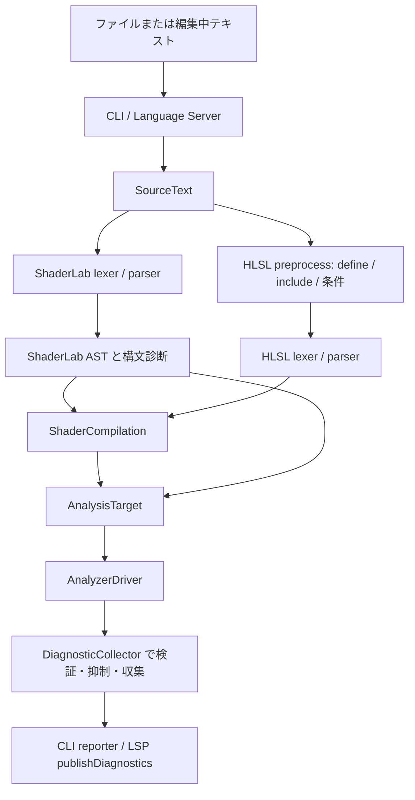

# 解析の流れ

`.shader` や `.compute` を受け取ってから診断を返すまでの処理を、CLI と言語サーバーの両方の経路でたどるためのページです。

## 目次

- [解析の流れ](#解析の流れ)
  - [目次](#目次)
  - [1. 全体像](#1-全体像)
  - [2. CLI から診断まで](#2-cli-から診断まで)
  - [3. エディタから診断まで](#3-エディタから診断まで)
  - [4. 字句解析と構文解析](#4-字句解析と構文解析)
  - [5. セマンティックモデルの組み立て](#5-セマンティックモデルの組み立て)
  - [6. ルールの実行](#6-ルールの実行)
  - [7. コードで追いかける手順](#7-コードで追いかける手順)
  - [関連](#関連)

---

## 1. 全体像

`.shader` は ShaderLab の外側に HLSL のプログラムブロックを含むため、ShaderLab の構文木だけで解析が完了するわけではありません。
CLI も言語サーバーも、同じ `AnalysisRunner` を通って同じ手順で解析します。違うのは、入口と、結果の返し方だけです。

---

## 2. CLI から診断まで

1. 実行ファイルの入口 [Shaderlyn.Cli.App/Program.cs](../../src/Shaderlyn.Cli.App/Program.cs) が組み込みルールを渡して `Program.RunAsync` を呼び、[Program.cs](../../src/Shaderlyn.Cli/Program.cs) が引数・対象ファイル・設定・意味解析の環境を整えます。
   自作ルール入りの CLI も、同じ `Program.RunAsync` を呼びます。
2. [AnalysisRunner.cs](../../src/Shaderlyn.Cli/AnalysisRunner.cs) がファイルを `SourceText` として読み、拡張子を [ShaderSourceKind.cs](../../src/Shaderlyn.Semantics/ShaderSourceKind.cs) 経由で判定します。`.shader` は ShaderLab、`.compute` や HLSL ファイルは HLSL として扱います。
3. 字句解析と構文解析を行います（[4 章](#4-字句解析と構文解析)）。
4. セマンティックモデル `ShaderCompilation` を組み立てます（[5 章](#5-セマンティックモデルの組み立て)）。
5. ルールを実行して診断を集めます（[6 章](#6-ルールの実行)）。
6. 利用者が書いて取り込んだヘッダの指摘は、取り込むシェーダーごとに出るので、同じ位置の同じ指摘を 1 件にまとめます（`AnalysisRunner.RunAsync`）。
7. テキスト / JSON / SARIF / GitHub 形式の reporter（`src/Shaderlyn.Cli/Reporting`）へ渡して書き出します。`--cache` があれば、変わっていないファイルは 2〜5 を飛ばして前回の結果を使います。

---

## 3. エディタから診断まで

1. 実行ファイルの入口 [Shaderlyn.LanguageServer.App/Program.cs](../../src/Shaderlyn.LanguageServer.App/Program.cs) が標準入出力をつないで [ShaderLanguageServer](../../src/Shaderlyn.LanguageServer/ShaderLanguageServer.cs) を起動します。
2. `ShaderLanguageServer` が `textDocument/didOpen` / `didChange` / `didSave` を受け（`OnDidOpenAsync` など）、編集中の内容を [OpenDocument](../../src/Shaderlyn.LanguageServer/OpenDocument.cs) に保持します。保存前の中身も解析できるのはこのためです。
3. `PublishAsync` が解析を別スレッドで起動し、同じスクリプトの古い解析はキャンセルします。解析の深さ (`AnalysisDepth`) は 2 段あります。

   | 契機 | 深さ | 内容 |
   | --- | --- | --- |
   | 開いたとき・保存したとき | `Full` | `#include` を解決してセマンティックモデルを作り、すべてのルールを実行する |
   | 入力のたび | `Syntax` | ShaderLab の構文木だけで済む検査を実行する |

4. [AnalysisSession](../../src/Shaderlyn.LanguageServer/AnalysisSession.cs) が、ワークスペースの設定と利用者が選んだ条件のシンボルを反映した `SemanticsOptions` を作り、`AnalysisRunner.Analyze` を呼びます。ここから先は CLI と同じです。
5. 集めた診断は、指摘があるファイルごとに分けて `textDocument/publishDiagnostics` として返します（`PublishAnalysisAsync`）。
   利用者が書いて取り込んだヘッダの指摘はヘッダの URI へ送り、同じヘッダを取り込む開いたスクリプトが複数あれば合わせて送ります。
   ヘッダへの指摘を更新するのは `Full` の解析のときだけです。効いていない分岐の範囲は `PublishInactiveRegionsAsync` で別に通知します。

---

## 4. 字句解析と構文解析

- **ShaderLab:** [ShaderLabSyntaxTree](../../src/Shaderlyn.ShaderLab/ShaderLabSyntaxTree.cs) が [ShaderLabLexer](../../src/Shaderlyn.ShaderLab/Parsing/ShaderLabLexer.cs) と [ShaderLabParser](../../src/Shaderlyn.ShaderLab/Parsing/ShaderLabParser.cs) を通して、トークン、構文木 (`ShaderLabCompilationUnitSyntax`)、構文診断を作ります。
- **HLSL:** 先にプリプロセッサがマクロの定義・`#include`・条件付きコンパイルを扱い、[HlslParser](../../src/Shaderlyn.Hlsl/Parsing/HlslParser.cs) が展開済みのトークン列から `HlslCompilationUnitSyntax` と構文診断を作ります。
  `.shader` に埋め込まれた HLSL は、切り出さずに ShaderLab の部分をマスクした複製の上で解析します。
- **取り込んだヘッダ:** Unity や外部パッケージのヘッダの関数は、速さのために中身を構文木にしません。
  利用者が書いて取り込んだヘッダ (`SemanticsOptions.IsUserInclude` が利用者のものとしたファイル) は、関数の中身まで構文木にします。
- **回復:** どちらのパーサも例外を投げずに回復します。解釈できない区間は `SkippedTokens` や `Incomplete` 系のノードにまとめ、その位置に診断を付けます。壊れた入力でも構文木を返すので、残りの部分の検査は続けられます。

---

## 5. セマンティックモデルの組み立て

[ShaderCompilationBuilder](../../src/Shaderlyn.Semantics/Programs/ShaderCompilationBuilder.cs) が ShaderLab の `Properties` と HLSL を結び、[ShaderCompilation](../../src/Shaderlyn.Semantics/ShaderCompilation.cs) を組み立てます。
組み立てを別の型に分けてあるのは、`ShaderCompilation` がルールから使われる問い合わせの面であり、作り方はそこに置く必要がないためです。

- 入口は、ShaderLab なら `ShaderCompilation.Create(text, tree, semantics)`、HLSL 単体なら `ShaderCompilation.CreateForHlsl(text, semantics)` です
- Unity のヘッダの解決は、`SemanticsOptions` に渡された include resolver が担います。
  どの取り込み先が利用者のファイルかは `SemanticsOptions.IsUserInclude` が決め、CLI と言語サーバーは `SemanticsSetup.CreateUserIncludePredicate` で作ります
  （プロジェクトの `Library` の下と Unity Editor に同梱のもの以外）
- `#ifdef` で分かれるコードは、既定の構成の木に両方の分岐を並べ、並べられないものはシンボルを有効にした構成 (`SymbolVariants`) を別に展開します（[条件付きコンパイルの扱い](../guide/conditional-compilation.md)）
- 取り込んだファイルの一覧は `AllIncludePaths` に残り、`AnalysisRunner` はこれをキャッシュの鍵に使います
- `ShaderCompilation.CreateAnalysisTarget()` が、構文木とセマンティックモデルをルール実行の単位 `AnalysisTarget` にまとめます。意味解析をしない場合は ShaderLab の構文木だけの単位になり、セマンティックモデルを必要とするルールは報告しません

シンボルの扱いの細部は [条件付きコンパイルの扱い](../guide/conditional-compilation.md#付録-実装の詳細) の付録にあります。

---

## 6. ルールの実行

[AnalyzerDriver](../../src/Shaderlyn.Core/Analysis/AnalyzerDriver.cs) が、登録済みの [DiagnosticAnalyzer](../../src/Shaderlyn.Core/Analysis/DiagnosticAnalyzer.cs) のアクションを実行します。
アナライザは、構文ノードやセマンティックモデルに関心を登録する形で書きます（Roslyn と同じ考え方）。組み込みのルールは `BuiltInAnalyzers.All` に静的に並べてあります。

[DiagnosticCollector](../../src/Shaderlyn.Core/Analysis/DiagnosticCollector.cs) は、宣言済みのルールか（`TOOL0005`）、メッセージの引数の数（`TOOL0006`）、重要度の上書き、抑制コメントを確かめてから診断を集めます。
ルールが例外を投げた場合、`AnalyzerDriver` は解析全体を止めずにそのルールだけを打ち切り、`TOOL0001` として報告します。

ルールが報告してよいかは `ShaderCompilation.IsReportable` で決めます。このファイルと、利用者が書いて取り込んだヘッダのコードを通し、
Unity や外部パッケージのヘッダのコードは通しません。ヘッダのコードは、取り込むシェーダーの文脈 (先に宣言された名前やシンボルの構成) で検査します。

---

## 7. コードで追いかける手順

1. **入口を決める:** CLI なら `Program.RunAsync`、エディタなら `ShaderLanguageServer.OnDidOpenAsync` から始めます
2. **`AnalysisRunner.Analyze` まで進む:** 言語サーバーは `PublishAsync` → `AnalysisSession.Analyze` を経由します
3. **構文解析を見る:** `ShaderLabParser` / `HlslParser` の `ParseCompilationUnit` で、エラーの報告と回復の仕方が分かります
4. **ルールを見る:** `DiagnosticAnalyzer` の派生クラスの `Initialize` で、どのノードに登録しているかを見ます
5. **実際の入力で確かめる:** CLI の `--inspect` で、構文木・トークン・式の型を 1 つの HTML で見られます（[CLI の使い方 8 章](../guide/cli-usage.md#8-解析の中身を見る)）

---

## 関連

- [条件付きコンパイルの扱い](../guide/conditional-compilation.md) — 付録に実装の細部
- [設計判断](design-decisions.md)
