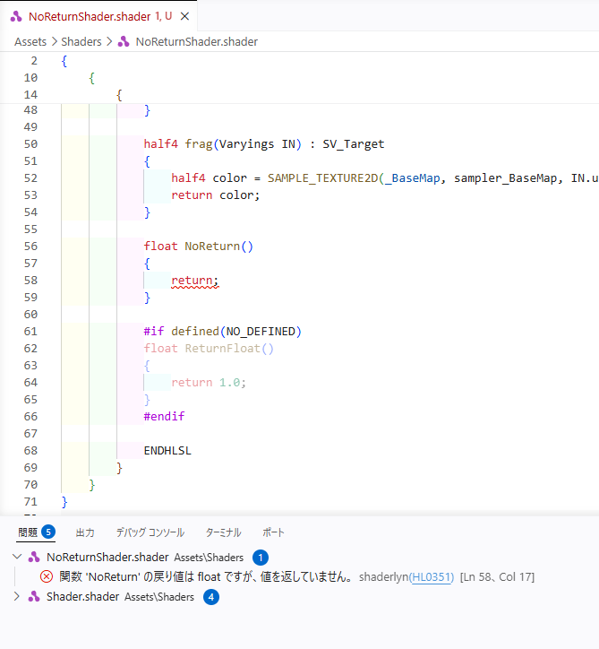
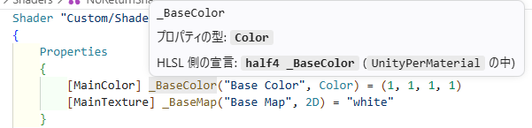
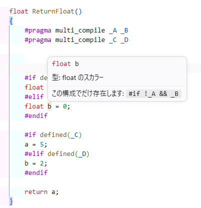
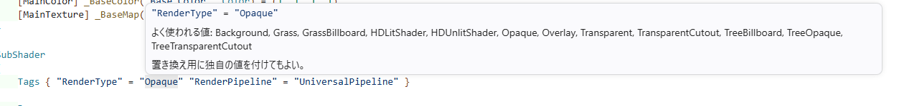
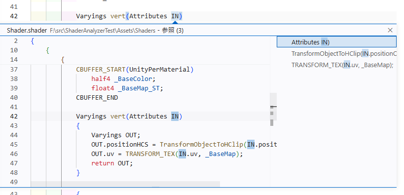
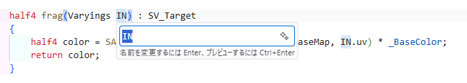
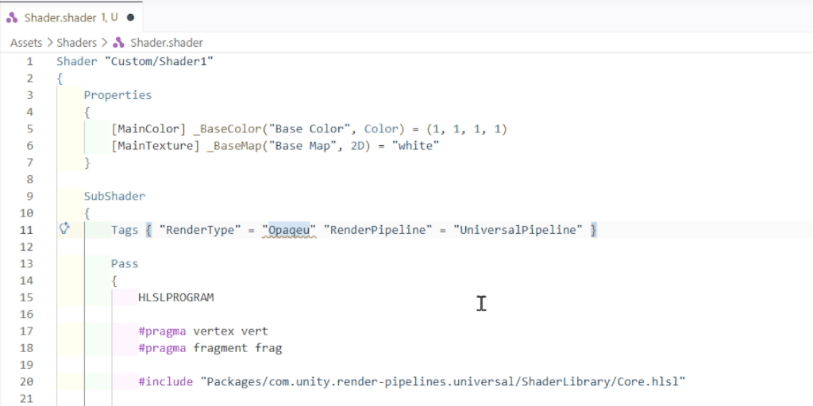
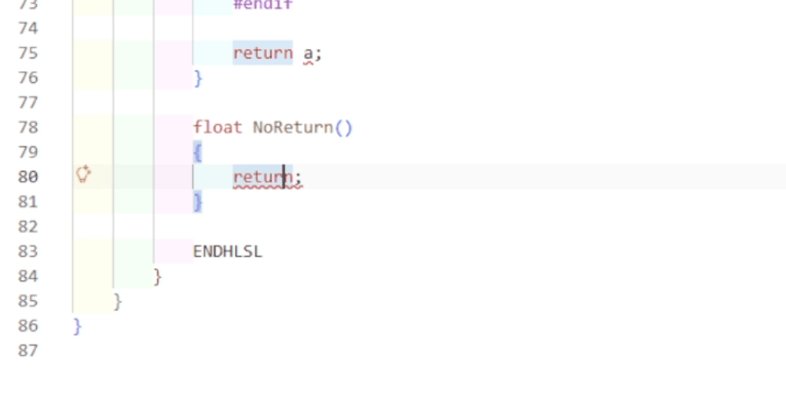
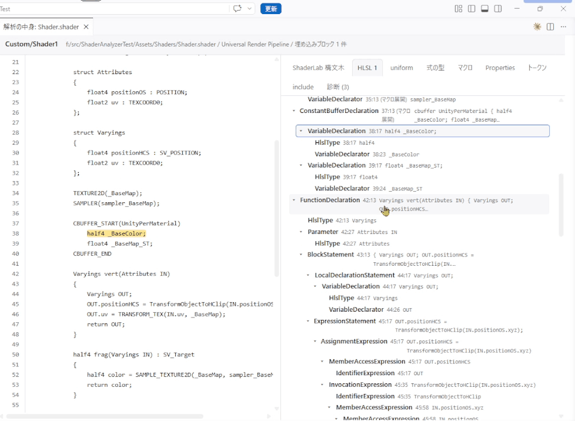
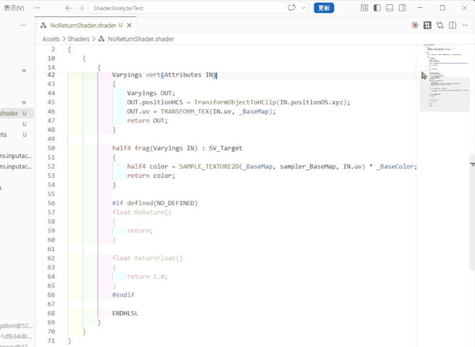

# Shaderlyn for VS Code

Unity の ShaderLab と HLSL（`.shader` / `.hlsl` / `.cginc` / `.hlslinc` / `.compute`）のリアルタイム静的解析・コーディング支援を提供する VS Code 拡張機能です。

## 主な機能

### 1. 快適性を損なわない 2段階の静的解析

入力中のストレスをなくすため、編集時と保存時で異なるレベルの解析を行います。

* **入力のたび（即時）:** 構文エラー、タグ、Pass 名、レンダーステート、プロパティ名などを高速チェック
* **ファイル保存時:** プロパティと HLSL の整合性（宣言漏れ・型不一致）、SRP Batcher 適合性など、`#include` の解決を要するチェック
* **取り込んだヘッダの指摘:** `.shader` を開いたとき・保存したときに、取り込んでいる共通の `.hlsl` などの指摘も、そのヘッダのファイルに出ます。取り込む側の文脈 (先に宣言した名前やシンボルの構成) で検査した結果です。Unity や外部パッケージのヘッダ (`Library` の下と Unity Editor に同梱のもの) は報告しません
* **有効になっている分岐の表示:** どの構成でも条件が外れる `#if` / `#ifdef` の中を薄く表示します。`multi_compile` などのシンボルのバリアントで通る分岐は薄くしません（シンボルを選んで、その構成で表示することもできます）。`SHADER_API_*` / `SHADER_STAGE_*` / `UNITY_VERSION` などプラットフォームやバージョンで決まる分岐、取り込むヘッダを解決できていない場合、展開の上限で調べきれなかったシンボルの分岐も、判断できないため薄くしません。開いたとき・保存したとき・シンボルを選んだときに更新されます（設定: `shaderlyn.inactiveRegions.enabled` / `.opacity`）



### 2. リッチなホバー情報（型・対応関係の可視化）

コード上にカーソルを置くだけで、型情報や構造体の構成、HLSL へのマッピング状態を確認できます。

* **プロパティと HLSL の対応:** `Properties` の項目が HLSL 側でどう宣言されているか（またはバッファにどう入っているか）を提示
* **型・式:** 判定された型（例: `uv.x` → `float`）、マクロの中身、定数バッファの構成や SRP Batcher への影響
* **言語要素:** セマンティクス（`SV_Target` 等）の意味、タグやレンダーステートで指定可能な値の一覧
* **`#pragma`:** `vertex` / `multi_compile_fog` / `shader_feature_local_fragment` などの役割と、エントリポイントやシンボルとして書かれた引数の意味








### 3. 定義への移動（F12）& 参照・補完支援

* **定義へ移動 (`F12`):** `Properties` 名と HLSL 側 uniform 名の相互ジャンプ、変数・関数・構造体・マクロの宣言箇所へジャンプ
* **Package Cache の自動解決:** `Packages/com.unity...` などの仮想パスを実際の `Library/PackageCache` 配下のファイルへ自動解決してジャンプ
* **インテリセンス・補完:** `#ifdef` などの条件付きコンパイル情報を考慮し、現在のコンテキストで利用可能なメンバーや引数（シグネチャヘルプ）を提示
* **一括リネーム (`F2`) / 参照検索 (`Shift+F12`):** スコープを正確に解釈し、安全にコードを変更・検索





### 4. クイックフィックス (コード修正)

電球アイコン（`Ctrl+.` / `Cmd+.`）から、1回の操作で問題を修正できます。

* **値の自動修正:** スペルミス（`SL1010` 等）など、正しい値が一意に定まる場合に修正案を提示
* **警告の抑制:** 該当行にルールID付きの抑制コメント（`// shaderlyn-disable-next-line <ID>`）を自動挿入





### 5. 解析状況のインスペクト（内部状態の可視化）

コマンドパレットから **「Shaderlyn: 解析の中身を見る」** を実行すると、構文木・トークン・式ごとの型判定結果・マクロ一覧を別タブで確認できます。エラーの原因特定に便利です。



### 6. HLSL ファイル単体の解析と条件のシンボル

`.hlsl` / `.cginc` / `.hlslinc` / `.compute` を開くと、ファイル全体を 1 つの HLSL として解析します。

`.hlsl` / `.cginc` / `.hlslinc` のような include 前提のファイルでは、次の 2 つを報告しません。(`.shader` に書くことが多いため)
`.compute` は 1 ファイルで完結するので報告します。

* シェーダーステージの `#pragma` が無い（`HL0302`）
* 宣言されていないシンボルを条件に使っている（`HL0330`）

**条件の中のコードを検査する:** 
`#ifdef _FOO` の `_FOO` をファイルのどこでも定義していないと、その分岐の中は解析されません。
エディタ右上のボタン（またはコマンドパレットの **「Shaderlyn: 条件のシンボルを選ぶ」**）で有効にするシンボルにチェックを入れると、`#define _FOO 1` と同じ状態で解析し直します。
`#include` 前提で `#define` を内部で書いていない場合等に有効です。

* 候補は、このファイルの `#if` / `#ifdef` が参照していて、`#define` にも取り込んだヘッダにも定義が無い名前です
* 選んだシンボルはファイルごとにワークスペースへ保存され、ウィンドウを再読み込みしても残ります
* チェックをすべて外して確定すると、定義を足さない状態に戻ります



### 7. シンボルの構成を選んで表示する

`.shader` でも HLSL のファイルでも使えます。

`#pragma multi_compile` / `#pragma shader_feature` のシンボルで分かれる分岐は、どれかの構成で通るので、ふだんは薄くしません。同じボタン（**「Shaderlyn: 条件のシンボルを選ぶ」**）でシンボルにチェックを入れて確定すると、そのシンボルだけを有効にした構成で、効いていない分岐を薄く表示します。

* チェックしなかったシンボルは無効として扱います。`multi_compile _ _A _B` で `_A` を選ぶと、`#ifdef _B` の中と `#ifdef _A` の `#else` 側が薄くなります
* 同じ `#pragma` の行に並べたシンボルは、同時には有効になりません。1 つにチェックを入れると、その行の他のチェックが外れます
* `_` を書いていない行（`multi_compile _A _B`）は、どれか 1 つが必ず有効です。その行を空にはできず、最後の 1 つを外すと戻ります
* シンボルを 1 つも有効にしない構成を見るには、**「すべての構成を合わせて表示」** のチェックを外して確定します。ただし `_` の無い行があると、その行には 1 つ入ります
* 元の表示に戻すには、**「すべての構成を合わせて表示」** にチェックを入れ、シンボルのチェックをすべて外して確定します
* 変わるのは薄く表示する範囲だけです。指摘はこれまでどおり、シンボルのバリアントをすべて検査した結果を出します
* プラットフォームで決まる分岐（`SHADER_API_*` など）と、取り込むヘッダを解決できない構成は、構成を選んでも薄くしません


---

## 導入と設定

### インストール

VS Code の拡張機能ビューで **Shaderlyn** を検索してインストールします（[Marketplace](https://marketplace.visualstudio.com/items?itemName=OmojiP.shaderlyn)）。
コマンドラインからは `code --install-extension OmojiP.shaderlyn` で入れられます。
言語サーバーを同梱しているので、.NET のインストールは不要です。

#### vsix から入れる

Marketplace を使えない環境では、[リリースページ](https://github.com/OmojiP/shaderlyn/releases) から使う環境の vsix を取得します。

| 環境                  | ファイル                                 |
| --------------------- | ---------------------------------------- |
| Windows (x64)         | `shaderlyn-vscode-win32-x64.vsix`        |
| macOS (Apple Silicon) | `shaderlyn-vscode-darwin-arm64.vsix`     |
| macOS (Intel)         | `shaderlyn-vscode-darwin-x64.vsix`       |
| Linux (x64)           | `shaderlyn-vscode-linux-x64.vsix`        |
| Linux (arm64)         | `shaderlyn-vscode-linux-arm64.vsix`      |

VS Code のコマンドパレットで **「拡張機能: VSIX からのインストール...」**（`Extensions: Install from VSIX...`）を選び、取得したファイルを指定します。
コマンドラインからは次のように入れられます。

```bash
code --install-extension shaderlyn-vscode-win32-x64.vsix
```

環境に合わない vsix を選ぶと、VS Code がインストールを断ります。

### 動作条件

* Unity プロジェクトのルート（`Assets` と `ProjectSettings` が存在するフォルダー）を VS Code で開いてください。自動でパッケージ参照などを解決します。

### 設定項目 (`settings.json`)

| 設定項目 | 説明 | 既定値 |
| --- | --- | --- |
| `shaderlyn.serverPath` | 独自ビルドした言語サーバーの実行ファイルパス（空の場合は同梱バイナリを使用）。変更したらウィンドウの再読み込みが必要です | `""` |
| `shaderlyn.trace.server` | VS Code と言語サーバー間の通信ログを出力パネルに記録する | `"off"` |
| `shaderlyn.inactiveRegions.enabled` | 条件が外れて効いていない `#if` / `#ifdef` の中を薄く表示する | `true` |
| `shaderlyn.inactiveRegions.opacity` | 効いていない範囲を表示するときの不透明度（0.1〜1） | `0.45` |

*※ ルールの詳細設定や無効化は、プロジェクトルートの `.shaderlyn.yaml` を参照します。*

### 自作ルールを使う

同梱の言語サーバーが実行するのは組み込みルールだけです。自作ルールをエディタでも働かせる場合は、アナライザの一覧を渡すサーバーを自分でビルドし、`shaderlyn.serverPath` に指します。

サーバーの作り方（プロジェクト・`Program.cs`・publish）は [自作ルールの作り方「エディタでも働かせる」](../../docs/custom-rules/tutorial.md#5-1-エディタでも働かせる) にあります。ここでは、ビルドしたサーバーを VS Code から使う手順を説明します。

#### 1. VS Code から指す

`settings.json` に、publish した**実行ファイル**の絶対パスを書きます。拡張はこのファイルを引数なしで起動するため、`.dll` は指せません。

```json
{
  "shaderlyn.serverPath": "C:/work/MyShaderRules.Lsp/bin/my-shader-rules-lsp.exe"
}
```

#### 2. ウィンドウを再読み込みする

コマンドパレット（`Ctrl+Shift+P` / `Cmd+Shift+P`）から **Developer: Reload Window** を実行します。

**設定を保存しただけでは、サーバーは切り替わりません。** 拡張は `shaderlyn.serverPath` を起動したときに一度だけ読みます。再読み込みするまでは前のサーバー（同梱のサーバーなど）が動き続け、エラーも出ないまま自作ルールの指摘だけが出ない状態になります。

次のときは、そのたびに再読み込みしてください。

- `serverPath` を変えたとき
- ルールを足したり直したりして、サーバーを publish し直したとき

再読み込みしたら `.shader` を開いて保存し、自作ルールの指摘が出るかを確かめます。HLSL を見るルールは、ファイルを開いたときと保存したときに走ります。打っている最中は ShaderLab 単体の検査だけが走るため、HLSL の指摘はいったん消え、保存すると戻ります。

> **Note**: Windows では、VS Code が動かしているサーバーの実行ファイルは上書きできません。同じフォルダーへ publish し直すと失敗するので、ウィンドウを閉じてから publish するか、別のフォルダーへ出して `serverPath` を変えてください。

#### つまずいたとき

症状ごとの原因と対処は [トラブルシューティング「VS Code 拡張」](../../docs/guide/troubleshooting.md#vs-code-拡張) にまとめてあります。
ルールそのものが指摘を出さない場合は、同じページの [「自作ルール」](../../docs/guide/troubleshooting.md#自作ルール) を見てください。

### 他のシェーダー関連拡張機能との共存について

本拡張機能は `.shader` や `.hlsl` に対する**独自言語の登録（構文ハイライトの強制上書き）を行いません**。VS Code 組み込みの `shaderlab` や、他の Unity / Shader 関連拡張機能のカラーリング機能を崩すことなく、静的解析とLanguage Server機能（補完・ホバー・定義ジャンプ等）のみを安全に追加します。

---

## ライセンス

MIT License

組み込み関数の表は DirectXShaderCompiler のデータから作っています。その著作権表示とライセンスは、拡張に同梱した THIRD-PARTY-NOTICES.txt にあります。